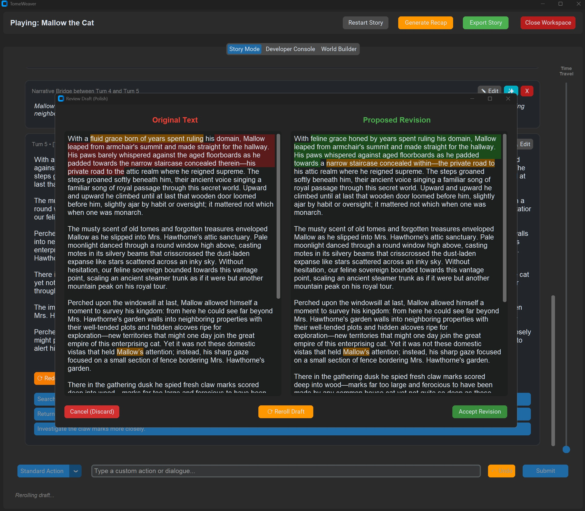

# TomeWeaver

A Stateful Narrative Orchestration Engine for LLMs. TomeWeaver bridges the gap between generative AI and structured game design, transforming player adventures into seamless, exportable storybooks.


---

## 🚀 The Vision

Most AI storytelling tools are "chaos simulators"—they struggle with context drift, lose track of goals, and produce "jumpy" prose. **TomeWeaver** is a narrative pipeline that treats a story as a structured database. 

It provides the "bones" of a game engine (inventory, chapters, goals, UI virtualization) and the "soul" of a novel, resulting in a journey that is fun to play and beautiful to read back later.

## ✨ Key Features

### 1. The "Non-Linear Video Editor" Timeline
Say goodbye to scrolling endless walls of text. TomeWeaver renders your story as a virtualized timeline of **Cards**. You can scrub back through history using the Time Travel slider, edit past turns, regenerate choices, or branch the story effortlessly.

### 2. Non-Destructive Editing (Visual Diffs)
When you ask the AI to "Polish" or "Expand" a scene, TomeWeaver does not blindly overwrite your history. It generates a **Draft** and opens a Git-style Visual Diff window, highlighting exactly what words the AI changed in Red and Green before you click "Accept."



### 3. The Visual "Codex" (Zero JSON Syntax Errors)
You never have to look at raw JSON brackets again. The built-in **World Builder** dynamically generates UI forms for strings, bulleted lists, and dictionaries, allowing authors to build massive, deeply nested world lore safely.

### 4. The "Story Forge" (AI Generation & Guided Wizard)
Banish the blank page. You can initialize a brand new world manually, use the **Guided Wizard** for a step-by-step onboarding experience, or type a single concept into the **AI World Generator** to instantly overhaul the entire cartridge with rich, AI-generated lore, settings, and goals.

### 5. Granular AI Co-Writing (Inspire & Reroll)
AI assistance isn't just for the main story. Every lore field, chapter goal, and inventory schema features dedicated **🪄 Inspire** and **⟳ Reroll** buttons. Type a quick shorthand idea, click Inspire, and watch the AI expand it into rich, cinematic detail. Stuck? Click the **💡 Help** button to browse dozens of ready-to-use templates.

### 6. Dual-Mode Storytelling
*   **Sandbox Mode:** Open-ended world simulation. Use the Director tools to manually trigger scene shifts, POV changes, or time-jumps.
*   **Campaign Mode:** Plot-driven adventures. The AI strictly follows a `plot_outline`, tracking goals and obstacles, and automatically triggers chapter transitions when you succeed.

### 7. Non-Destructive Narrative Bridging
TomeWeaver solves the "narrative gap" common in AI games. 
*   **The Problem:** You click "Go inside" and the next paragraph starts inside, leaving a jarring jump-cut.
*   **The Solution:** TomeWeaver auto-generates a **Narrative Bridge**—a surgical patch that weaves your action into the prose. These bridges are stored as metadata, meaning your original human-curated prose is never modified.

### 8. The "Fortress" JSON Sanitizer & Error Handler
Local LLMs often struggle with strict JSON formatting. TomeWeaver’s multi-stage sanitizer is built for extreme resilience:
*   **State-Machine Repair:** Differentiates between structural JSON markers and rogue dialogue quotes.
*   **Surgical Repair:** Uses Python's error-coordinate metadata to "patch" missing quotes or trailing commas before giving up.
*   **Truncation Recovery:** If the AI hits its token limit mid-sentence, the engine auto-balances the JSON so you can continue playing without a crash.
*   **API Translator:** Gracefully intercepts network timeouts, 429 rate limits, and 502 bad gateways, providing human-readable UI alerts instead of crashing.

### 9. Modern Native UX
TomeWeaver feels like a professional OS application. It features global OS-standard keyboard shortcuts (`Ctrl+Z` to undo, `Ctrl+Backspace` to delete words), fully dynamic flat-UI text wrapping without clunky scrollbars, and object-pooled rendering for buttery-smooth performance.

### 10. Storybook Compiler (Export)
Export your adventure as a polished **TXT, Markdown, or HTML** file. The engine compiles your chronological game log into a cleanly formatted, readable document.

### 11. Autonomous Long-Term Memory (RAG Engine)
Play infinitely without breaking your model's context limit. TomeWeaver features a background Retrieval-Augmented Generation (RAG) engine that silently compiles your history into dense, token-efficient ledgers.
*   **Tiered Summarization:** Automatically compresses 10-turn chunks into "Parts," and finished chapters into high-level summaries.
*   **The Auto-Decay Engine:** Characters, Locations, Artifacts, and Factions are tracked dynamically. If an entity hasn't been mentioned in 40 turns, they are quietly "Archived" out of the AI's prompt to save memory, and instantly "Revived" the moment they reappear in the story.
*   **Continuity Auditor:** Includes a built-in QA tool that cross-references the Plot Ledger against the Lore Bible to flag contradictions, complete with 1-click Auto-Patching. 

🧠 **[Read the deep dive into the RAG Engine (docs/RAG.md)](docs/RAG.md)**

---

## 🧠 Supported LLM Providers

TomeWeaver is provider-agnostic and supports any API compatible with the OpenAI specification. Use the **API Connections Manager** in the UI to plug in your provider of choice.

### 🌟 Highly Recommended: LM Studio (Local AI)
We strongly recommend running TomeWeaver locally using **[LM Studio](https://lmstudio.ai/)**. 
*   **100% Free & Private:** Runs entirely on your own hardware offline. No subscriptions, no data harvesting.
*   **Uncensored:** Cloud providers (like OpenAI or Anthropic) often filter dark fantasy, horror, or gritty violence. Local models do not.
*   **Infinite Play:** Play a 5-hour campaign or a 50-hour campaign; you will never have to pay per token.

📖 **[Read the LM Studio Setup & Model Guide](docs/LM_STUDIO_CONFIG.md)** for step-by-step instructions on configuring the local server, preventing context-limit crashes, and downloading our curated list of the best local models for JSON-based story generation.

### Cloud Providers
If you do not have a dedicated GPU, TomeWeaver supports cloud providers seamlessly:
*   **OpenAI:** Native support for GPT-4o, GPT-5 and GPT-5.5.
*   **OpenRouter:** Access Claude 3.5 Sonnet, Llama 3.1, and dozens of other top-tier models for pennies.
*   **Gemini & Grok:** Fully compatible via their respective OpenAI-compatible endpoints.

---

## 🛠️ Installation & Setup

### Prerequisites
*   **Python 3.10+** (Ensure Python is added to your system PATH)
*   **An LLM Provider** (Local via LM Studio, or Cloud via an API key).

### Option A: Windows (Automated Setup)
We provide an automated setup script that creates an isolated virtual environment, installs the UI dependencies, and generates your Master Launcher.

1.  **Clone or Download the Repo:**
    ```cmd
    git clone https://github.com/dobrado76/TomeWeaver.git
    cd TomeWeaver
    ```
2.  **Run the Installer:**
    Double-click the `setup.bat` file in the root directory. This will download everything needed for the GUI.
3.  **Launch the Engine:**
    Double-click the newly generated `Start_TomeWeaver.bat`. This will boot the main Graphical Interface.

### Option B: macOS / Linux / Manual Setup
If you are on a UNIX-based system or prefer setting up your environment manually:

1.  **Clone the Repo:**
    ```bash
    git clone https://github.com/dobrado76/TomeWeaver.git
    cd TomeWeaver
    ```
2.  **Create and Activate a Virtual Environment:**
    ```bash
    python3 -m venv venv
    source venv/bin/activate
    ```
3.  **Install Dependencies:**
    ```bash
    pip install -r requirements.txt
    ```
4.  **Launch the GUI:**
    *(Ensure your virtual environment is active before running)*
    ```bash
    python gui.py
    ```
---

## 📖 The Adventure "Cartridge" System

TomeWeaver treats every adventure as a self-contained "Cartridge" (a folder inside `/adventures`). You can easily share your worlds or back up your saves just by zipping the folder.

### Core Configuration Files (Author Created)
To build a new adventure, these files dictate the logic:
*   `setup.json`: The "DNA" of your world. Defines the tone, characters, plot outline, and mechanics. *(Edited via the World Builder UI tab).*
*   `system_prompt.txt`: The core rules and strict formatting instructions for your AI Game Master.
*   `prologue.txt` *(Optional)*: A hand-written opening text to anchor the start of your story.
*   `epilogue.txt` *(Optional)*: A hand-written closing text for when the campaign goal is achieved.
*   `start_turn.json` *(Optional)*: A "Story Seed." Provide a pre-generated Turn 1 JSON object to guarantee players begin with a specific, high-quality hook and set of choices.

### Engine State Files (Auto-Generated)
As you play, TomeWeaver automatically generates and manages these files to maintain the game state:
*   `history.json`: The master ledger. A perfect chronological record of every turn, AI response, player choice, and narrative bridge.
*   `chapters.json`: The pacing metadata. Tracks where chapters begin and end.
*   `session_log.txt`: The "Flight Recorder." A diagnostic log of every API call, retry, and raw JSON output for debugging your prompts.

---

## 📚 Official Documentation

TomeWeaver is a massive, feature-rich application. Please refer to our dedicated guides for detailed instructions on using the UI and configuring your worlds:

*   🖼️ **[The UI Walkthrough (docs/README.md)](docs/README.md)** - A visual guide to the Library Dashboard, Story Timeline, and Editors.
*   ⌨️ **[Gameplay & User Guide (docs/COMMAND_GUIDE.md)](docs/COMMAND_GUIDE.md)** - How to play, time-travel, and use Director tools.
*   ⚙️ **[Configuration & Architecture (docs/CONFIG_GUIDE.md)](docs/CONFIG_GUIDE.md)** - Deep dive into how the engine processes Campaign logic, goals, and JSON schemas.

---

## 🤝 Contributing

We welcome contributions! Whether it's improving the "Fortress" sanitizer, adding new export formats, or sharing your own Adventure Cartridges:
1.  Fork the repository.
2.  Create your feature branch (`git checkout -b feature/AmazingFeature`).
3.  Commit your changes (`git commit -m 'Add AmazingFeature'`).
4.  Push to the branch (`git push origin feature/AmazingFeature`).
5.  Open a Pull Request.

---

## ⚖️ License & Commercial Use

TomeWeaver is released under the **Polyform Non-Commercial License 1.0.0**.

### What this means:
- ✅ **Personal Use:** You can use, modify, and play with TomeWeaver for free forever.
- ✅ **Contribution:** You are encouraged to fork the repo and submit Pull Requests to improve the engine.
- ✅ **Education/Research:** You can use this code for learning or academic purposes.
- ❌ **Commercial Use:** You **cannot** sell this software, use it to power a paid service, or include it in a commercial product without a separate agreement.

**For commercial licensing inquiries, please contact the author directly via [GitHub Profile](https://github.com/dobrado76).**

---

**TomeWeaver** — *Play the game. Export the novel.*