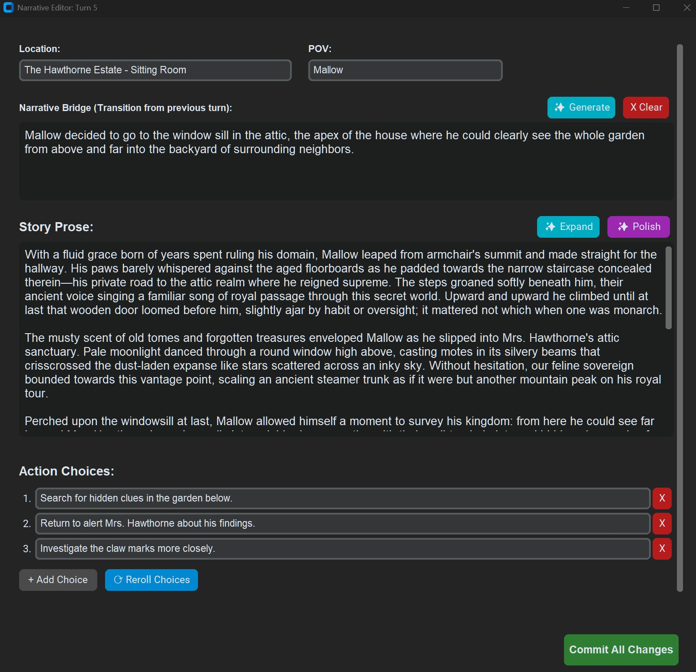

--- START OF FILE docs/README.md ---

# TomeWeaver: User Interface Guide

TomeWeaver features a modern, dark-mode desktop GUI built on `CustomTkinter`. This guide provides a visual walkthrough of the application's major interfaces and how to use them.

---

## 1. The Library Dashboard

When you launch TomeWeaver, you are greeted by the Library Dashboard. This is your central hub for managing Adventure Cartridges.

*   **Create New Story:** Generates a fresh boilerplate workspace. When creating a story, you must choose a mode:
    *   **Sandbox Mode:** Open-ended and player-driven. You explore a persistent world without a predefined ending.
    *   **Campaign Mode:** Plot-driven and structured. The AI follows a strict chapter outline and won't let you progress until specific goals are achieved.
*   **Import .zip:** Allows you to load an adventure cartridge shared by a friend.
*   **Global Settings (⚙):** Opens the API configuration window to set up your local LM Studio connection or cloud API keys.
*   **Story Cards:** Each card displays the story's mode, turn count, current location, and status. Click **Play** to enter the Workspace, or use the **Options** dropdown to Export, Rename, or Restart.

---

## 2. The Story Workspace (Timeline)

Clicking "Play" on an adventure opens the Workspace. The **Story Mode** tab is where the game is played. The engine only renders the 3 most recent turns to keep memory usage low, but you can scrub through older turns using the **Time Travel Slider** on the far right.

### 2.A The Header Buttons
At the very top of the Workspace, you have quick-access utility buttons:
*   **▶︎ Auto-Play (Campaign Only):** A developer tool. The engine plays itself by automatically selecting the first choice every 2 seconds until the game ends, allowing you to rapidly stress-test your Chapter Goals.
*   **Restart Story:** Deletes your current history and restarts the adventure from Turn 0.
*   **Generate Recap:** Asks the AI to read your entire history and generate a "Story So Far" summary. Great for picking up an old save.
*   **Export Story:** Opens the export menu. Converts your adventure history into a readable `TXT`, `Markdown`, or `HTML` storybook.

### 2.B Card Tools (Non-Destructive Editing)
Attached to the bottom of the active Turn Card are several powerful editing tools. TomeWeaver treats interactive fiction like a drafting process. 

*   **⟳ Redo Turn:** *Destructive.* Discards the AI's entire current turn and forces it to generate a brand new response to your last action.
*   **⟳ Choices:** *Safe.* Keeps the story prose exactly as it is, but forces the AI to generate a brand new list of green action choices.
*   **✨ Expand:** *Safe.* Adds rich sensory details and cinematic length to the current scene without advancing the plot.
*   **✨ Polish:** *Safe.* Acts as a professional copy-editor. Fixes grammar and sentence flow while strictly preserving the plot and dialogue.
*   **🔧 Fix...:** *Safe.* Opens a prompt asking for an instruction. (e.g., "Make it raining"). Generates a Draft applying your fix.

*(Note: "Safe" tools do not overwrite your game immediately. They open the Visual Diff window for your approval).*

### 2.C The Narrative IDE (Edit Window)
If you click **✎ Edit** on the top right of any story card (past or present), you open the Narrative IDE.

*   **Manual Overwrites:** You can directly fix typos in the prose, change the location text, or rewrite the choices.
*   **Regenerate Bridges:** If a Narrative Bridge between turns is awkward, you can delete it or ask the AI to regenerate it directly from this window.
*   **Set as Story Seed:** If you are editing Turn 0 or Turn 1, a special **💾 Set as Story Seed** button appears. This saves your exact prose and choices to `start_turn.json`. Any time this adventure is restarted, it will perfectly load your hand-crafted hook instead of generating a random one.

### 2.D The Input Bar & Actions
At the very bottom of the Story Timeline is the Input Bar.

You can click the green choices generated by the AI, or type your own custom action into the text box. In **Sandbox Mode**, you have access to a Director Dropdown to force the AI's hand:
*   **Standard Action:** The default. Your text is treated as what the protagonist does or says.
*   **Expand Notes:** Co-write with the AI! Type a brief summary like "I defeat the guards in an epic sword fight," and the AI will expand it into cinematic prose.
*   **Force Setting:** Type a new location. The AI will instantly transition the scene.
*   **Force Time:** Type a time-jump (e.g., "Three days later").
*   **Force POV:** Shift the perspective to a different character.

### 2.E UI Differences: Sandbox vs. Campaign
TomeWeaver adapts its UI based on the mode you are playing:
*   **Campaign Mode:** The Input Bar dropdown is hidden (Director overrides are disabled to prevent sequence breaking). A new **Chapter Outline** tab appears at the top, and the **Auto-Play** button becomes available in the header.
*   **Sandbox Mode:** The **Chapter Outline** tab is hidden, as the story is free-form. The Director Dropdown in the Input Bar is unlocked, giving you full control over time and space.

---

## 3. Non-Destructive Editing (Visual Diffs)

When you use "Safe" Card Tools like Expand, Polish, or Fix, the engine opens the **Review Draft** modal.

*   **Red Highlights:** Words the AI removed from the original text.
*   **Green Highlights:** New words the AI inserted.
*   **Safety First:** If the AI hallucinates, simply click **⟳ Reroll Draft** to ask the LLM to try again, or **Cancel** to discard it entirely.

---

## 4. The World Builder (Codex)

The World Builder tab replaces the need to manually edit `setup.json` files. It translates the raw code of the engine into a user-friendly master-detail editor.

*   **Core Settings:** The first sub-tab manages the Title, Author, Tone, and mechanical rules (Inventory Tracking, Permadeath).

' tab. On the left is a list of custom lore keys like 'family' and 'magic_rules'. On the right is the Visual JSON Editor showing a grid of Key-Value textboxes being edited.")

*   **Custom Lore (Codex):** Allows you to add infinite custom fields to your world. When you click "+ Add New Entry", you choose a data type (String, List, Dictionary). The UI dynamically transforms into the correct editor, preventing you from ever making a JSON syntax error.

---

## 5. Chapter Outline Editor (Campaign Only)

If you are playing a Campaign, the **Chapter Outline** tab becomes available. This acts as the "Director's Script" for the adventure.

. Right pane shows text fields for Chapter Title, Goal, Obstacles, Setting Override, and POV.")

*   **Pacing the Plot:** The AI reads the active chapter's "Goal" and "Obstacles" every turn. It will not allow the player to progress until the conditions of the Goal are met in the story.
*   **Reordering:** You can easily add new chapters or use the arrow buttons to move plot beats up and down the timeline.

---

## 6. Narrative Bridges

TomeWeaver solves the "narrative gap" common in AI storytelling. 

**The Problem:** In standard AI games, you choose an action like *"Go inside the tavern."* The AI responds by immediately describing the interior of the tavern. When you read the story back later, it feels like a jarring jump-cut. 

**The Solution:** Narrative Bridges.
*   **What they are:** Small, italicized paragraphs generated *between* your main story cards. They surgically convert your clicked action into third-person (or first-person) prose that matches the tense of the surrounding story.
*   *(Example Action: "Go inside") -> (Example Bridge: "Deciding the chill was too much, he pushed open the heavy oak doors and stepped inside.")*
*   **How they work:** You don't have to do anything. If "Auto Narrative Bridge" is enabled in your Global Settings, the engine spawns a silent background thread while you play. It looks at the action you just took, looks at the new scene the AI just generated, and writes a bridge connecting them.
*   **Non-Destructive:** Bridges are stored as metadata. They do not permanently alter the main prose of the story, meaning you can regenerate them or delete them in the Narrative IDE without breaking the game's logic.