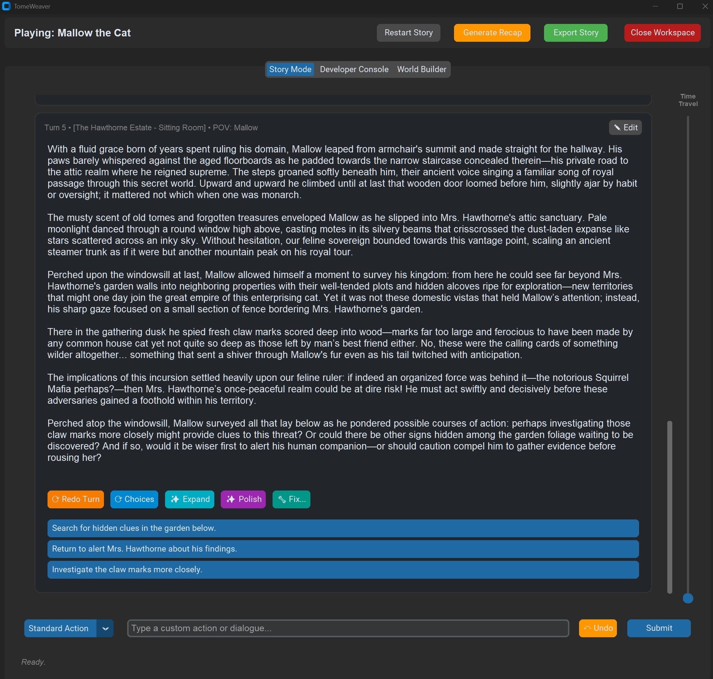

# TomeWeaver: User Interface Guide

TomeWeaver features a modern, dark-mode desktop GUI built on `CustomTkinter`. This guide provides a visual walkthrough of the application's major interfaces and how to use them.

## 1. The Library Dashboard

When you launch TomeWeaver, you are greeted by the Library Dashboard. This is your central hub for managing Adventure Cartridges.

*   **Create New Story:** Generates a fresh boilerplate workspace.
*   **Import .zip:** Allows you to load an adventure cartridge shared by a friend.
*   **Global Settings (⚙):** Opens the API configuration window to set up your local LM Studio connection or cloud API keys (OpenRouter, OpenAI).
*   **Story Cards:** Each card displays the story's mode (Sandbox/Campaign), turn count, current location, and status. Click **Play** to enter the Workspace, or use the **Options** dropdown to Export, Rename, or Restart.

---

## 2. The Story Workspace (Timeline)

Clicking "Play" on an adventure opens the Workspace. The **Story Mode** tab is where the game is played.

*   **Card Virtualization:** The engine only renders the 3 most recent turns to keep memory usage low. You can scrub through older turns using the **Time Travel Slider** on the far right.
*   **Narrative Bridges:** Between main story cards, you will see smaller italicized text blocks. These are the AI-generated "Bridges" that seamlessly connect your action to the resulting scene.
*   **Director Controls:** The colored buttons (`⟳ Redo Turn`, `✨ Expand`, `✨ Polish`, `🔧 Fix...`) allow you to sculpt the AI's prose before moving on to the next turn.

---

## 3. Non-Destructive Editing (Visual Diffs)

If you click `✨ Polish` or `🔧 Fix...` on a story card, the engine does not immediately overwrite your game. Instead, it generates a draft and opens the **Review Draft** modal.

*   **Red Highlights:** Words the AI removed from the original text.
*   **Green Highlights:** New words the AI inserted.
*   **Safety First:** If the AI hallucinates, simply click **⟳ Reroll Draft** to ask the LLM to try again, or **Cancel** to discard it entirely.

---

## 4. The World Builder (Codex)

The World Builder tab replaces the need to manually edit `setup.json` files. It translates the raw code of the engine into a user-friendly master-detail editor.

*   **Core Settings:** The first sub-tab manages the Title, Author, Tone, and mechanical rules (Inventory Tracking, Permadeath).

' tab. On the left is a list of custom lore keys like 'family' and 'magic_rules'. On the right is the Visual JSON Editor showing a grid of Key-Value textboxes being edited.")

*   **Custom Lore (Codex):** Allows you to add infinite custom fields to your world. When you click "+ Add New Entry", you choose a data type (String, List, Dictionary). The UI dynamically transforms into the correct editor, preventing you from ever making a JSON syntax error.

---

## 5. Chapter Outline Editor (Campaign Only)

If you are playing a Campaign, the **Chapter Outline** tab becomes available. This acts as the "Director's Script" for the adventure.

. Right pane shows text fields for Chapter Title, Goal, Obstacles, Setting Override, and POV.")

*   **Pacing the Plot:** The AI reads the active chapter's "Goal" and "Obstacles" every turn. It will not allow the player to progress until the conditions of the Goal are met in the story.
*   **Reordering:** You can easily add new chapters or use the arrow buttons to move plot beats up and down the timeline.