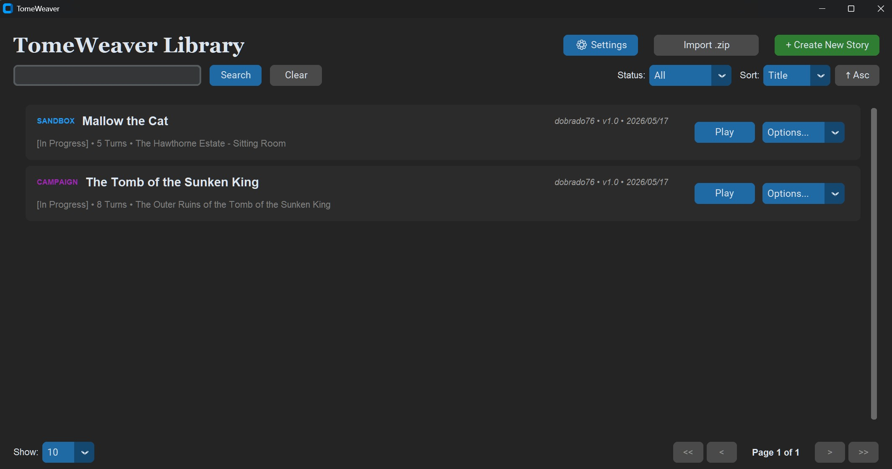
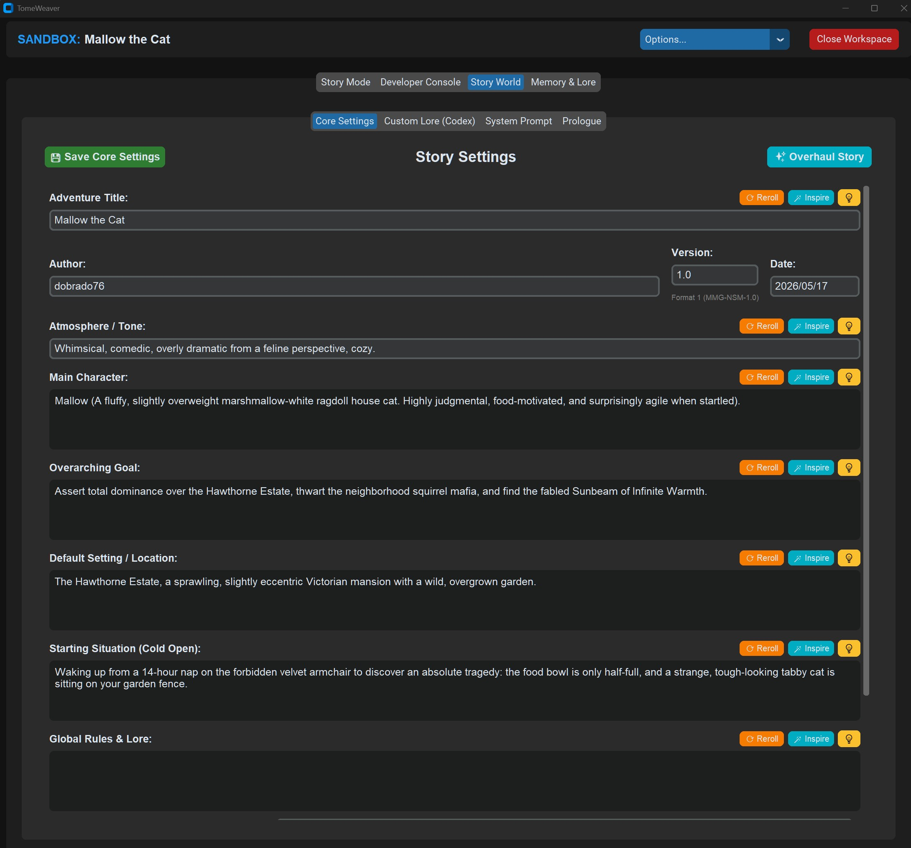
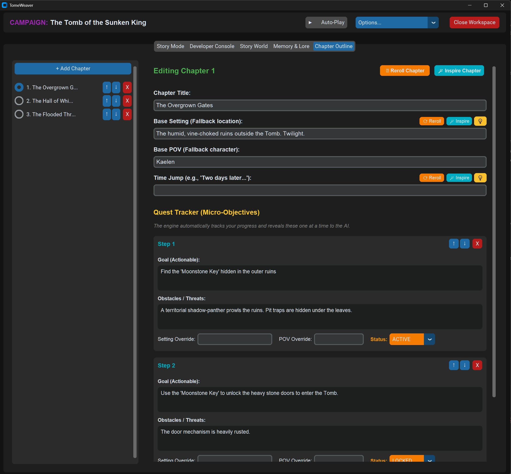
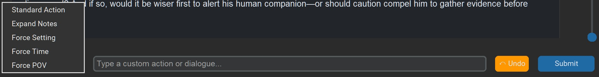

# TomeWeaver: User Interface Guide

TomeWeaver features a modern, dark-mode desktop GUI built on `CustomTkinter`. This guide provides a visual walkthrough of the application's major interfaces and how to use them.

**Related guides:**
*   [Gameplay & Timeline Surgery (COMMAND_GUIDE.md)](COMMAND_GUIDE.md)
*   [Configuration & Architecture (CONFIG_GUIDE.md)](CONFIG_GUIDE.md)
*   [Long-Term Memory / RAG (RAG.md)](RAG.md)
*   [LM Studio Setup (LM_STUDIO_CONFIG.md)](LM_STUDIO_CONFIG.md)
*   [Future Roadmap (FUTURE.md)](FUTURE.md)
*   [NSM Architecture Article (PDF)](article/MMG-NSM-1.0%20-%20The%20Narrative%20State%20Machine.pdf) — [LaTeX source](article/main.tex)
*   [Root README — full feature list & Known Limitations](../README.md)

---

## 1. The Library Dashboard

When you launch TomeWeaver, you are greeted by the Library Dashboard. This is your central hub for managing Adventure Cartridges. The dashboard features a blazing-fast virtualized grid, allowing you to seamlessly search, sort, and navigate through hundreds of nested folders and stories.

### The "Story Forge" (Creating a New Adventure)
Clicking the green **+ Create New Story** dropdown in the top right offers three distinct ways to build a new world:
1.  **Manual Setup:** Opens a clean, single-page form allowing you to instantly type out the Title, Author, and Rules for a new Sandbox or Campaign.
2.  **Generate via AI:** Don't know what to write? Type a single concept prompt (e.g., *"A cyberpunk detective hunting a rogue AI"*), and the engine will automatically generate the title, lore, chapters, and setting for you.
3.  **Guided Wizard:** The ultimate onboarding tool. Walks you step-by-step through a clean, multi-screen process to define your protagonist, tone, and goals.

Once a story is created, the engine automatically routes you directly into the **World Builder** tab so you can review your configuration.

### Story Management
Each card displays the story's mode, turn count, current location, and status. Click **Play** to enter the Workspace. Use the **Options** dropdown on any card to Rename, Move, Delete, or **Export to .zip** (full cartridge or branch pack).

### Search, Sort & Pagination
The filter bar lets you instantly narrow the library:
*   **Keyword Search:** Matches titles, authors, tones, and folder names via a pre-built search index.
*   **Sort:** Order by title, turn count, last modified, or mode.
*   **Pagination:** Adjust items-per-page for large libraries (10,000+ stories remain responsive thanks to the background `index.json` cache).

### Import & Organization
*   **Import .zip:** Loads a **full cartridge** (new story folder) or a **branch pack** (merge shared timelines into an existing story). Full imports validate `setup.json` and `system_prompt.txt`; branch packs open a target-story picker with setup fingerprint checks.
*   **Custom Icons:** Right-click folder cards to assign a custom PNG/JPG thumbnail for at-a-glance recognition.
*   **Breadcrumb Navigation:** Drill into nested Universe folders; the **+ Create New Story** menu adapts to offer **Create Thread** when inside a universe.

### Global Settings & Themes
Open **⚙ Settings** to configure API keys, engine rules, and the **global Active Theme** preset. Use the **…** button beside the theme dropdown to open the visual theme editor (colors, borders, corner rounding). Per-story themes are optional in **Story World → UI Theme**; players opt in via **Workspace Options**. See [CONFIG_GUIDE.md](CONFIG_GUIDE.md) for `themes.json` and `setup.json` theme fields.

---

## 2. The World Builder (Codex)

The World Builder tab replaces the need to manually edit `setup.json` files. It translates the raw code of the engine into a user-friendly master-detail editor.

### Granular AI Co-Writing
TomeWeaver is a true Narrative IDE. Every major field in the World Builder features granular AI assistance:
*   **🪄 Inspire:** Type a quick shorthand idea (e.g., *"Grumpy dwarf"*), click Inspire, and the AI will expand it into rich, cinematic detail based on the overall context of your world.
*   **⟳ Reroll:** Completely stuck? Click Reroll, and the AI will invent a brand new, highly creative entry for that field from scratch.
*   **💡 Help:** Opens a scrollable modal packed with high-quality templates and examples. Click any example to instantly apply it to the field.

### Custom Lore (Codex)
Allows you to add infinite custom fields to your world. When you click "+ Add New Entry", you choose a data type (String, List, Dictionary). The UI dynamically transforms into the correct editor, preventing you from ever making a JSON syntax error.

### Inventory Schema Editor
If you enable "Track Inventory & Health", a visual pill-editor appears. You can define up to 8 tracking slots. When you hit Save, the AI will automatically scan your slots and assign perfectly matching Emojis and Hex Colors to them!

### Optional UI Theme
Under **UI Theme (optional, travels with export)**, authors can attach a recommended visual preset to `setup.json`. Full cartridges and branch packs include these colors. Players default to their **global Settings** theme and can opt into the story skin from **Workspace Options**.

### ✨ The "Master Overhaul" Button
At the very top of the Core Settings tab is the **Generate World** button. If you are ever unhappy with your current story, you can use this to completely overwrite the active cartridge with a brand new AI-generated world without having to return to the Dashboard.

---

## 3. Chapter Outline Editor (Campaign Only)

If you are playing a Campaign, the **Chapter Outline** tab becomes available. This acts as the "Director's Script" for the adventure.

*   **Pacing the Plot:** The AI reads the active chapter's "Goal" and "Obstacles" every turn. It will not allow the player to progress until the conditions of the Goal are met in the story.
*   **Reordering:** You can easily add new chapters or use the arrow buttons to move plot beats up and down the timeline.
*   **AI Plotting Board:** The Chapter Outline features its own dedicated AI generator. Click **🪄 Inspire Chapter**, and the AI will look at the events of Chapter 1, figure out what naturally happens next, and automatically write Chapter 2 for you!

---

## 4. The Story Workspace (Timeline)

Clicking "Play" on the Dashboard opens the Workspace. The **Story Mode** tab is where the game is played. The engine only renders the 3 most recent turns to keep memory usage low, but you can scrub through older turns using the **Time Travel Slider** on the far right.

### Workspace Header & Options Menu
The top bar shows the active mode (Sandbox or Campaign) and story title. Use the **Options...** dropdown for advanced workflows:
*   **Generate Recap** — AI summary of everything played so far.
*   **Generate Missing Bridges** — Batch-novelize transition prose across history.
*   **Slice Chapters...** — Extract selected chapters into a new standalone story folder.
*   **Run Tree...** — Browse timeline branches, switch between them, restore & fork, export/import branch packs.
*   **Use Story Theme / Use My Global Theme** — (When the author bundled a skin) switch workspace appearance.
*   **Import Turns...** — Paste bulk prose with action markers to splice into the timeline.
*   **Export Story** — Compile the active timeline to TXT, Markdown, or HTML.
*   **Restart Story** — Wipe root history (optional save to run tree first; respects Story Seed / prologue bypasses).

Campaign mode also exposes **▶︎ Auto-Play** for stress-testing chapter goals.

### The Turn Cards
Each card represents a single turn. It displays the active Chapter, Location, POV, and the **Story Prose**.
If Inventory tracking is enabled, the bottom of the card displays a dynamic, flat-UI ribbon of **Inventory Pills**. These pills seamlessly update every turn to reflect the protagonist's exact physical health, items, and status.

### The Input Bar & Actions
At the very bottom of the Story Timeline is the Input Bar.

You can click the green choices generated by the AI, or type your own custom action into the text box. In **Sandbox Mode**, you have access to a Director Dropdown to force the AI's hand:
*   **Standard Action:** The default. Your text is treated as what the protagonist does or says.
*   **Expand Notes:** Co-write with the AI! Type a brief summary like "I defeat the guards in an epic sword fight," and the AI will expand it into cinematic prose.
*   **Force Setting:** Type a new location. The AI will instantly transition the scene.
*   **Force Time:** Type a time-jump (e.g., "Three days later").
*   **Force POV:** Shift the perspective to a different character.
*   **Force Chapter:** Instantly triggers a Cold Open, starting a brand new chapter with the text you provide as the setting.

### Timeline Editor (Historical Cards)
When you scrub to an older turn via the Time Travel slider, a toolbar appears on that card:
*   **+ Insert Turn** — Blank card, **Generate — continue story**, or **Generate — bridge the gap** (see [COMMAND_GUIDE.md](COMMAND_GUIDE.md)).
*   **X Delete Turn** — Master Clock surgery (see [COMMAND_GUIDE.md](COMMAND_GUIDE.md)).
*   **↔ Turn to Bridge / ↔ Bridge to Turn** — Collapse or expand transition prose.
*   **✂ Split Chapter / ← Merge Chapter** — Chapter boundary editing (Sandbox and Campaign).
*   **⑂ Fork Here** — (When valid) Archive the full timeline and reopen choices at this turn, creating a parent + branch pair in the Run Tree.
*   **✎ Edit Scene** — Open the full scene editor to manually rewrite prose, choices, location, inventory, or save a **Story Seed**.

---

## 4b. Run Tree (Alternate Timelines)

Open **Options → Run Tree…** to manage parallel playthroughs stored in `runs/manifest.json`. Each row is a **live timeline** with its own snapshot (`history`, `chapters`, `memory`).

| Action | What it does |
| :--- | :--- |
| **Switch** | Saves the current timeline to its snapshot, then loads the selected one. Disabled on the row marked **● playing now**. |
| **Restore & Fork…** | Load an archive and fork @ a chosen turn (creates new parent + branch nodes). |
| **Export…** | Package selected timelines as a **branch pack** `.zip` to share. |
| **Import…** | Merge a friend's branch pack into this story (compare paths side by side via Switch). |
| **Rename / Delete** | Manage labels or remove archived snapshots. |

**Fork Here** on the timeline (historical turns with a committed choice and future turns) is the primary way to create branches during play. **Restart → Save** archives the current line before a wipe. Switching never creates extra tree nodes—it only updates snapshots in place.

**Sharing workflow:** Export a branch pack → friend imports into their copy of the same story → both use Run Tree to flip between local and imported timelines.

---

## 5. Non-Destructive Editing (Visual Diffs)

TomeWeaver treats interactive fiction like a drafting process. Attached to the bottom of every Turn Card are several powerful editing tools: **⟳ Redo Turn**, **⟳ Choices**, **✨ Expand**, **✨ Condense**, **✨ Polish**, and **🔧 Fix...**

When you use "Safe" Card Tools like Expand, Polish, or Fix, the engine does not blindly overwrite your history. Instead, it opens the **Review Draft** modal.

*   **Red Highlights:** Words the AI removed from the original text.
*   **Green Highlights:** New words the AI inserted.
*   **Safety First:** If the AI hallucinates, simply click **⟳ Reroll Draft** to ask the LLM to try again, or **Cancel** to discard it entirely.

---

## 6. Narrative Bridges

TomeWeaver solves the "narrative gap" common in AI storytelling. 

**The Problem:** In standard AI games, you choose an action like *"Go inside the tavern."* The AI responds by immediately describing the interior of the tavern. When you read the story back later, it feels like a jarring jump-cut. 

**The Solution:** Narrative Bridges.
*   **What they are:** Small, italicized paragraphs generated *between* your main story cards. They surgically convert your clicked action into third-person (or first-person) prose that matches the tense of the surrounding story.
*   *(Example Action: "Go inside") -> (Example Bridge: "Deciding the chill was too much, he pushed open the heavy oak doors and stepped inside.")*
*   **How they work:** You don't have to do anything. If "Auto Narrative Bridge" is enabled in your Global Settings, the engine spawns a silent background thread while you play. It looks at the action you just took, looks at the new scene the AI just generated, and writes a bridge connecting them.
*   **Non-Destructive:** Bridges are stored as metadata. They do not permanently alter the main prose of the story, meaning you can regenerate them or delete them in the Narrative IDE without breaking the game's logic.

---

## 7. The Developer Console

The Workspace features a dedicated **Developer Console** tab. This acts as the engine's "Flight Recorder." It provides a real-time, scrolling, color-coded view of the engine's internal states. If the engine catches an API timeout, rate limit, or JSON syntax error, it is broadcast here in real-time, allowing advanced users to monitor exactly what the LLM is doing under the hood.

When **Log Verbose** is enabled in Global Settings, full prompts and raw LLM responses are also written to `session_log.txt` inside the adventure folder for offline debugging.

---

## 8. Memory & Lore (RAG Console)

The **Memory & Lore** tab is your visual interface to the long-term memory system. It is available for every story and becomes especially powerful inside Shared Universes.

### Tab Bar Navigation
The UI is organized by **top tabs** (with live count badges):

*   **Chapters** — Full-width editor for high-level chapter summaries.
*   **Plot** — Full-width editor for chronological Part summaries.
*   **Characters / Locations / Artifacts / Factions** — Master-detail layout: a scrollable entity list on the left (with an optional name filter when count > 15) and the Lore Bible editor on the right. Each entity tab remembers your last selection.

### Plot & Chapter Ledgers
On the **Plot** and **Chapters** tabs, each summary card supports:
*   **✔️ Validate** — Fidelity score vs. raw history.
*   **🔧 Auto-Patch Summary** — Rewrite a summary using the QA report.

### Entity Lore Bible
Select any entity from a ledger tab to edit traits, author notes, event history, and visibility state:
*   **Active / Archived / Pinned** — Control whether the entity is injected into prompts (see [RAG.md](RAG.md)).
*   **🔗 Merge...** — Combine duplicates with smart trait merging and alias creation.
*   **Deep Rename** — Two-phase scan + authorized rename across RAM and universe files.
*   **Deep Scan** — Re-read history in chunks to extract missed traits and events for one entity.

### Compile Missing History
Click **🔄 Compile Missing History** to run the background RAG compiler in one of four modes (Base Lore, Standard, Deep Entity Scan, Integrity Check). Required after major timeline surgery or universe migration.

---

## 9. Universe Tab (Shared Universes Only)

When a story is tethered to a Shared Universe, a **Universe** tab appears alongside Story World. It edits the universe-level `master_setup.json` (global tone, lore, rules) that is dynamically prepended to every thread's prompt. Changes here affect **all** stories in that universe—local story settings remain in the **Story World** tab.

---

## ⚠️ Known Limitations (UI)

*   **Only three turns render at once** in Story Mode for performance; older turns load when you scrub the Time Travel slider—they are not lost, just virtualized.
*   **Auto-Play is Campaign-only** because Sandbox has no defined "win" condition to test against.
*   **Universe tabs and orange Global entity icons** only appear for threads inside a properly configured Shared Universe folder.
*   **Memory & Lore entity tabs** show a name filter only when that ledger has more than 15 entries.
*   **Custom folder icons** are cosmetic; they do not affect engine logic or prompts.
*   **The GUI does not surface every engine_config key.** Some advanced settings (e.g., `max_inventory_keys`) are edited via Global Settings or direct JSON edit.

For a complete list of engine-wide limitations, see the **Known Limitations** section in the [root README](../README.md).